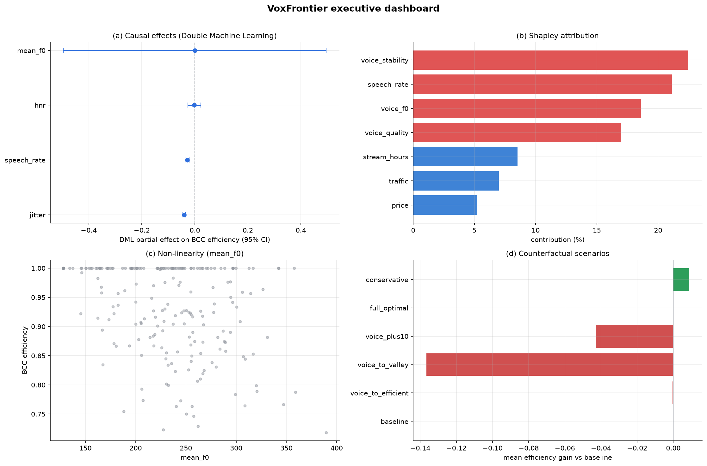

# VoxFrontier

[English](#english) | [中文](#中文)

[](https://github.com/GOOD-123-CPU/voxFrontier/actions/workflows/ci.yml)
[](LICENSE)
[](pyproject.toml)
[](https://github.com/astral-sh/ruff)
[](CITATION.cff)
[](src/voxfrontier/py.typed)

VoxFrontier is a reproducible research pipeline for studying how voice
features relate to live-streaming efficiency. It combines efficiency-frontier
measurement, attribution, nonlinear mechanism tests, causal estimation, and
counterfactual simulation in one auditable Python package.

The repository is designed to be safe to inspect and rerun: all bundled data is
synthetic, outputs are reproducible from a fixed seed, and each run writes a
manifest with hashes for the input data and generated result tables.



---

<a id="english"></a>
## English

### What This Project Answers

VoxFrontier asks a practical research question:

> Do a live-streamer's voice characteristics, such as pitch, stability, voice
> quality, and speech rate, affect streaming efficiency? If so, how large is the
> effect, through which mechanisms, and what would happen under intervention?

The project is not a single model or a dashboard mockup. It is an end-to-end
pipeline that starts from a synthetic session-level dataset and produces
frontier scores, attribution tables, nonlinear tests, causal estimates,
simulation results, figures, and a reproducibility manifest.

### Why It Is Useful

VoxFrontier connects several analytical stages so their outputs can be
inspected together. Interpretation depends on the data-generating process
and the assumptions of each method:

| Need | VoxFrontier provides |
|---|---|
| Measure efficiency | Input-oriented DEA under CCR/BCC assumptions, scale efficiency, and super-efficiency ranking |
| Explain contribution | Exact Shapley decomposition, random-forest importance, optional SHAP, Tobit models, and mediation analysis |
| Detect mechanisms | Quadratic U-shape tests, threshold-regime regression, quantile bands, and subgroup interactions |
| Estimate causal effects | Cross-fitted Double Machine Learning with Neyman-orthogonal scores and FWL/OLS benchmarks |
| Evaluate interventions | Six counterfactual scenarios with uncertainty-aware diagnostics |
| Reproduce results | Seeded synthetic data, deterministic outputs, and SHA-256 run manifests |

### Interpretation and Limits

The bundled results are **synthetic-data demonstrations**, not empirical evidence about a real platform. The generator explicitly embeds nonlinear and threshold patterns; recovering them demonstrates behavior under that design, not independent discovery.

- DEA scores measure relative efficiency within the selected sample and input/output specification.
- Shapley shares and feature importance describe model attribution; they do not establish causal effects.
- DML estimates require identification assumptions, including adequate observed controls and treatment variation. Cross-fitting alone does not remove unobserved confounding.
- Scenario outputs are predictions under changed inputs, not validated intervention outcomes.
- A fixed seed and matching file hashes help audit a run; they do not establish scientific validity or guarantee identical results across dependency versions.

Read [methodology](docs/methodology.md) alongside the result tables before interpreting estimates.

### Quick Start

Requirements: Python 3.9 or newer.

```bash
git clone https://github.com/GOOD-123-CPU/voxFrontier.git
cd voxFrontier
pip install -e .
vxf run-all
```

This creates or refreshes:

```text
data/synthetic/     synthetic session-level data
output/             CSV result tables, run_summary.json, manifest.json
figures/            analytical plots and dashboard image
```

You can also run only the synthetic-data stage:

```bash
vxf synth
```

Use verbose logging when you want to inspect each stage:

```bash
vxf -v run-all
```

### Installation Options

Core install:

```bash
pip install -e .
```

Development install:

```bash
pip install -e ".[dev]"
```

Optional DEA MILP backend:

```bash
pip install -e ".[pulp]"
```

Optional SHAP support:

```bash
pip install -e ".[shap]"
```

The default DEA backend uses SciPy HiGHS. PuLP/CBC is available as an optional
backend and is equivalence-tested against the default path.

### Main Outputs

| File | Purpose |
|---|---|
| `output/dea_efficiency_by_unit.csv` | DEA efficiency scores by unit and model specification |
| `output/dea_model_summary.csv` | Frontier-level summary statistics |
| `output/shapley_decomposition.csv` | Voice and control-group contribution decomposition |
| `output/tobit_ols.csv`, `output/tobit_mle.csv` | Censored-regression attribution models |
| `output/quadratic_tests.csv` | U-shape and turning-point tests |
| `output/threshold_regression.csv` | Threshold-regime estimates |
| `output/dml_effects.csv` | Debiased voice-effect estimates from Double Machine Learning |
| `output/scenario_simulation.csv` | Counterfactual intervention results |
| `output/run_summary.json` | Compact machine-readable run summary |
| `output/manifest.json` | Reproducibility manifest with file hashes and environment metadata |

### Repository Layout

```text
src/voxfrontier/       package source
tests/                 unit and end-to-end tests
config/default.yaml    central pipeline configuration
data/synthetic/        generated synthetic dataset
output/                reproducible result tables
figures/               generated figures
docs/                  methodology, user guide, FAQ
examples/              library usage examples
```

### Configuration

The default configuration lives at `config/default.yaml`. It controls the random
seed, input/output directories, synthetic-data size, DEA model specifications,
attribution settings, nonlinear variables, simulation scenarios, and plotting
language.

To use a custom configuration:

```bash
vxf -c path/to/config.yaml run-all
```

Keep private or licensed data outside Git. The repository ignores `data/raw/`,
`data/private/`, and spreadsheet files by default.

### Use as a Library

```python
from voxfrontier.config import Config
from voxfrontier.pipeline import run_all

cfg = Config.load("config/default.yaml")
run_all(cfg)
```

See [`examples/custom_analysis.py`](examples/custom_analysis.py) for a fuller
example.

### Reproducibility and Integrity

Every full run writes `output/manifest.json`. The manifest records the input
dataset hash, output table hashes, package version, Python version, platform,
and selected dependency versions. You can verify generated outputs with:

```python
from voxfrontier.utils.manifest import verify_manifest

result = verify_manifest("output")
assert all(result.values()), result
```

This makes result drift visible: if a table changes, the corresponding manifest
check fails.

### Data and Privacy

This repository contains only synthetic data generated by
`voxfrontier.data.synth`. It does not include real streamer names, room IDs,
audio files, platform identifiers, user profiles, private spreadsheets, or
production exports.

The CI pipeline includes a local-only privacy audit that scans the working tree
and Git history for common personal-path patterns and rejects tracked Excel
files. Pre-commit hooks provide the same style of local guard before changes are
committed.

### Quality Bar

```bash
ruff check src tests
pytest
```

GitHub Actions runs linting, privacy checks, tests across Python 3.9/3.11/3.12,
multi-platform smoke tests, manifest verification, and CodeQL analysis.

### Documentation

- [`docs/methodology.md`](docs/methodology.md): estimator definitions,
  equations, assumptions, and references.
- [`docs/user_guide.md`](docs/user_guide.md): workflow, configuration, API
  usage, and troubleshooting.
- [`docs/faq.md`](docs/faq.md): short answers to common questions.
- [`CONTRIBUTING.md`](CONTRIBUTING.md): development setup and contribution
  standards.
- [`SECURITY.md`](SECURITY.md): private vulnerability and privacy reporting.
- [`CHANGELOG.md`](CHANGELOG.md): release history.

### Citation

See [`CITATION.cff`](CITATION.cff), or cite:

```bibtex
@software{voxFrontier2026,
  title  = {VoxFrontier: causal and efficiency-frontier analytics for
            voice-driven livestream performance},
  year   = {2026},
  url    = {https://github.com/GOOD-123-CPU/voxFrontier},
  license = {MIT}
}
```

### License

VoxFrontier is released under the [MIT License](LICENSE).

---

<a id="中文"></a>
## 中文

### 项目定位

VoxFrontier 是一个面向研究和复现的 Python 分析流水线，用来回答：

> 主播的声音特征，例如基频、音质、稳定性、语速，是否会影响直播效率？
> 如果会，影响有多大、机制是什么、干预后可能发生什么？

它不是单个回归模型，也不是只展示图表的样例项目。它从合成的直播场次数据
出发，完整生成 DEA 效率得分、贡献归因、非线性检验、因果估计、反事实模拟、
图表和可复现性 manifest。

### 核心能力

| 问题 | 方法 |
|---|---|
| 谁更有效率 | 投入导向 DEA，CCR/BCC，规模效率，超效率排名 |
| 声音贡献多大 | 精确 Shapley 分解，随机森林重要性，可选 SHAP，Tobit，中介分析 |
| 是否存在非线性机制 | 二次 U 型检验，门槛回归，分位数带，亚组交互 |
| 在识别假设下估计效应 | 交叉拟合 Double Machine Learning，FWL/OLS 基准 |
| 如果干预声音变量会怎样 | 六组反事实场景模拟和不确定性诊断 |
| 结果能否复现 | 固定随机种子，结果表哈希，运行 manifest |

### 结果解读与边界

仓库结果是**合成数据上的方法演示**，不代表真实平台的实证结论。数据生成器预设了非线性和门槛关系；恢复这些模式反映的是方法在该生成机制下的表现。

- DEA 得分取决于参照样本和投入产出设定，表示相对效率。
- Shapley 份额与特征重要性属于模型归因，不能直接解释为因果贡献。
- DML 的因果解释依赖充分观测控制变量、处理变量具有足够变异等识别假设；交叉拟合本身不能消除未观测混杂。
- 场景模拟是修改输入后的模型预测，尚不能视为经过验证的真实干预效果。
- 固定种子和文件哈希帮助核对复现记录；跨依赖版本的数值一致性与方法有效性仍需另行检查。

阅读结果时请同时查看 [方法说明](docs/methodology.md) 中的数据生成机制与估计量设定。

### 快速开始

需要 Python 3.9 或更新版本。

```bash
git clone https://github.com/GOOD-123-CPU/voxFrontier.git
cd voxFrontier
pip install -e .
vxf run-all
```

运行后会生成或刷新：

```text
data/synthetic/     合成数据
output/             CSV 结果表、run_summary.json、manifest.json
figures/            分析图和总览 dashboard
```

只重新生成合成数据：

```bash
vxf synth
```

输出更详细日志：

```bash
vxf -v run-all
```

### 安装选项

```bash
pip install -e .          # 核心依赖
pip install -e ".[dev]"   # 开发、测试、lint
pip install -e ".[pulp]"  # 可选 DEA MILP 后端
pip install -e ".[shap]"  # 可选 SHAP 支持
```

默认 DEA 后端使用 SciPy HiGHS；PuLP/CBC 是可选后端，并通过测试与默认路径做
一致性校验。

### 主要输出

| 文件 | 含义 |
|---|---|
| `output/dea_efficiency_by_unit.csv` | 各单元在不同模型设定下的 DEA 效率 |
| `output/dea_model_summary.csv` | 前沿模型汇总 |
| `output/shapley_decomposition.csv` | 声音变量组和控制变量组的贡献分解 |
| `output/tobit_ols.csv`, `output/tobit_mle.csv` | Tobit 归因模型 |
| `output/quadratic_tests.csv` | U 型关系和转折点检验 |
| `output/threshold_regression.csv` | 门槛机制估计 |
| `output/dml_effects.csv` | DML 去偏后的声音效应估计 |
| `output/scenario_simulation.csv` | 反事实干预模拟 |
| `output/run_summary.json` | 机器可读的运行摘要 |
| `output/manifest.json` | 输入和结果哈希、环境信息、版本信息 |

### 目录结构

```text
src/voxfrontier/       包源码
tests/                 单元测试和端到端测试
config/default.yaml    默认配置
data/synthetic/        合成数据
output/                可复现结果表
figures/               生成图表
docs/                  方法、用户指南、FAQ
examples/              作为库调用的示例
```

### 配置方式

默认配置在 `config/default.yaml`，其中包含随机种子、路径、合成数据规模、
DEA 设定、归因参数、非线性变量、模拟情景和绘图语言。

使用自定义配置：

```bash
vxf -c path/to/config.yaml run-all
```

真实或授权数据应只放在本地，不要提交到 Git。仓库默认忽略 `data/raw/`、
`data/private/` 和电子表格文件。

### 复现与校验

完整运行会写出 `output/manifest.json`，记录输入数据哈希、结果表哈希、
包版本、Python 版本、系统平台和关键依赖版本。可以用下面的方式校验：

```python
from voxfrontier.utils.manifest import verify_manifest

result = verify_manifest("output")
assert all(result.values()), result
```

如果某个结果表被改动，对应的 manifest 校验会失败。

### 数据与隐私

本仓库只包含由 `voxfrontier.data.synth` 生成的合成数据。仓库中不包含真实主播
姓名、直播间 ID、音频、平台标识、用户画像、私人表格或生产环境导出数据。

CI 会进行本地规则的隐私审计，扫描工作区和 Git 历史中的常见个人路径模式，
并拒绝被跟踪的 Excel 文件。pre-commit 也提供同类本地检查。

### 开发检查

```bash
ruff check src tests
pytest
```

GitHub Actions 会运行 lint、隐私检查、Python 3.9/3.11/3.12 测试、多平台
冒烟测试、manifest 校验和 CodeQL 安全分析。

### 文档入口

- [`docs/methodology.md`](docs/methodology.md)：估计量定义、数学公式、假设和参考文献。
- [`docs/user_guide.md`](docs/user_guide.md)：工作流、配置、API 使用和故障排查。
- [`docs/faq.md`](docs/faq.md)：常见问题。
- [`CONTRIBUTING.md`](CONTRIBUTING.md)：开发和贡献规范。
- [`SECURITY.md`](SECURITY.md)：漏洞与隐私问题的私密报告方式。
- [`CHANGELOG.md`](CHANGELOG.md)：版本记录。

### 引用

见 [`CITATION.cff`](CITATION.cff)，或使用：

```bibtex
@software{voxFrontier2026,
  title  = {VoxFrontier: causal and efficiency-frontier analytics for
            voice-driven livestream performance},
  year   = {2026},
  url    = {https://github.com/GOOD-123-CPU/voxFrontier},
  license = {MIT}
}
```

### 许可证

VoxFrontier 使用 [MIT License](LICENSE) 开源。
